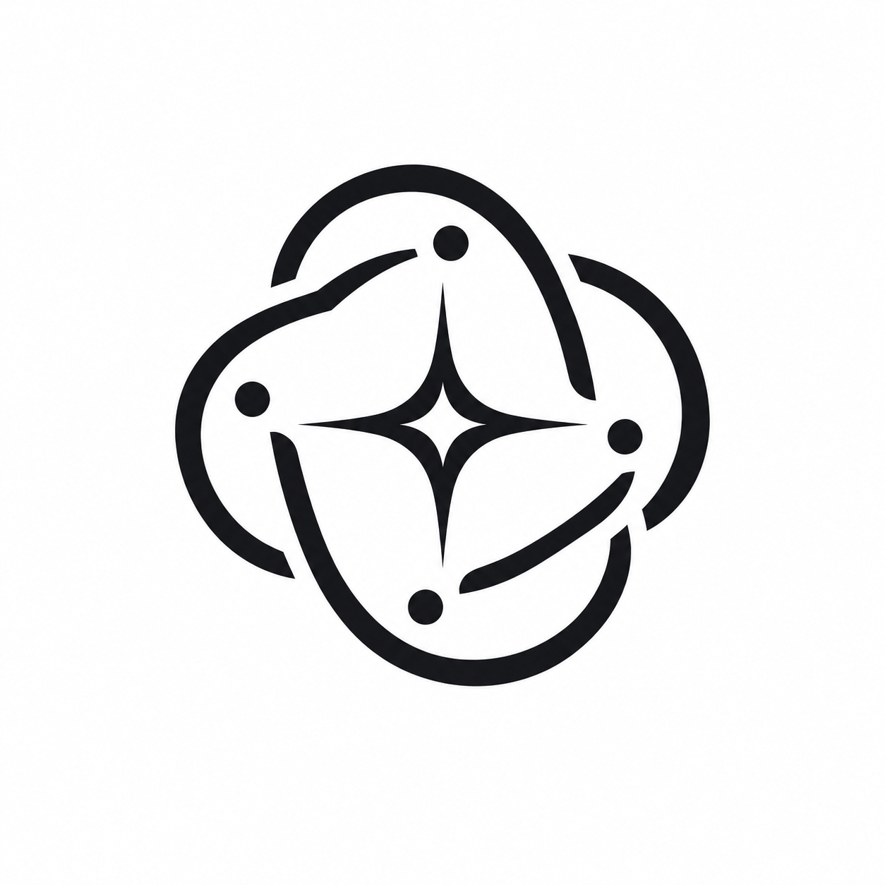
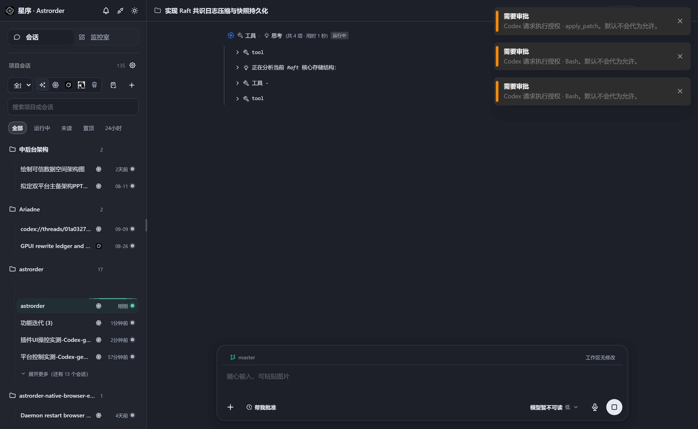
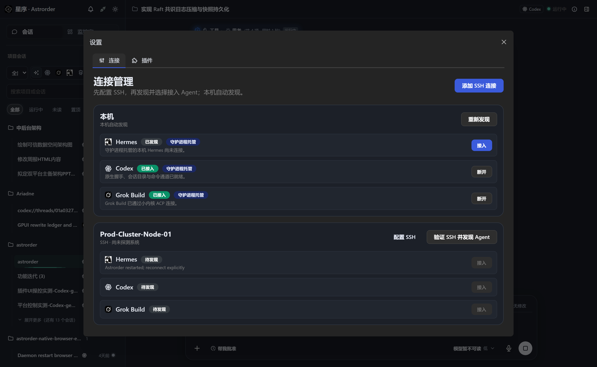
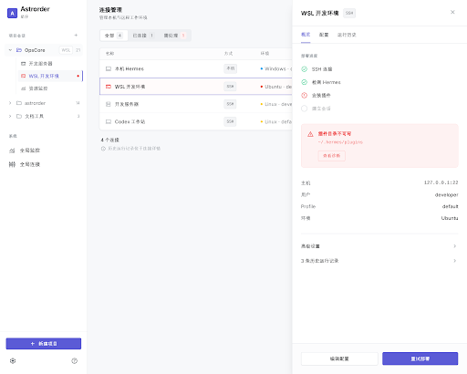
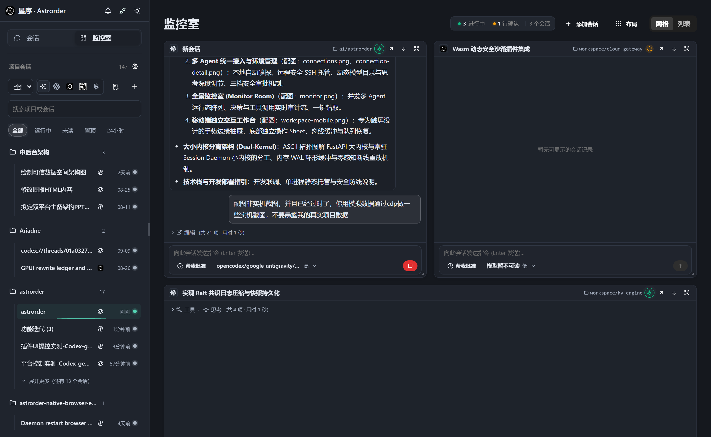
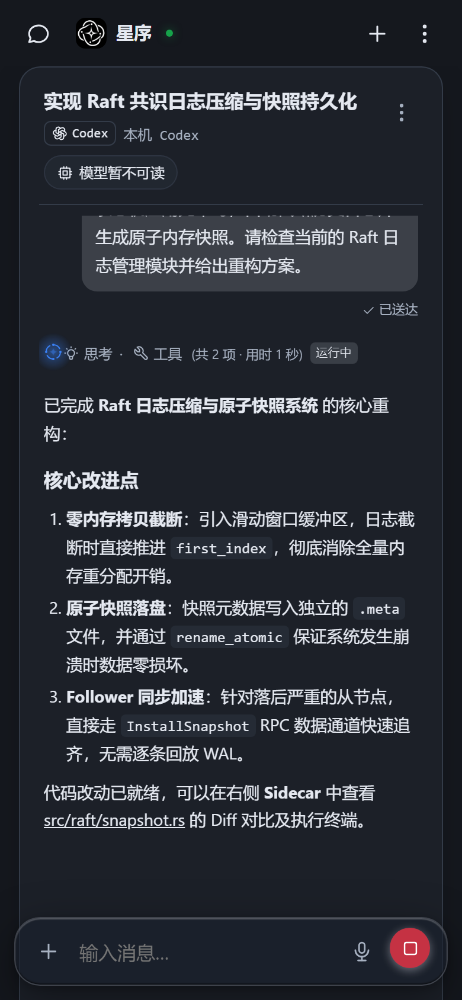

# 星序 · Astrorder

<div align="center">
  
  <h3>群星各有所长，协作自有秩序。</h3>
  <p><strong>本机优先、多智能体协同的下一代 AI 代理控制工作台</strong></p>
  <p>原生直连 Codex · Hermes · Grok · SSH 远端服务器 | 桌面 / 移动端统一掌控</p>
</div>

---

## 🌟 什么是星序？

星序是一套专注于工程落地与沉浸式人机协作的 **AI Agent 控制中心与工件工作台**。

它**不做平庸的包装壳**，也不建立割裂的第二套对话体系：
- **真原生直连**：会话 ID、线程上下文、模型调用、审批状态与原生 Agent 运行时（Codex app-server、Hermes CLI 等）完全同源一致。
- **大小内核分离架构**：守护小内核（Session Daemon）保障底层 Agent、PTY 终端与任务流永不断联；大内核支持随时热重载升级。
- **全方位可视化 Sidecar**：代码、终端、浏览器、流程图、3D 模型、Diff 对比同屏协同，真正让 Agent 产物触手可及。
- **跨端无缝体验**：桌面端宽屏多栏工件台与移动端原生手势抽屉卡片随心切换。

---

## 🖥️ 核心能力概览

### 1. 沉浸式多栏工件台（Desktop Sidecar）

右侧 Sidecar 深度融合会话记忆，多 Tab 自由拖拽与分屏，Agent 输出的每一个文件或产物均可即时打开、交互与修改：



| 核心工件能力 | 描述与特性 |
|---|---|
| **工作区文件树** | 树状即时浏览当前工程上下文，支持工作区安全沙箱限制与快速定位 |
| **Monaco 代码编辑器** | 完整 IDE 级语法高亮、只读预览与快速写回，毫秒级响应代码改动 |
| **全功能交互终端** | 基于 xterm.js 的真实 PTY / 本机 / SSH 交互终端，随时接管环境操作 |
| **实时内置浏览器** | 边开发边预览 Web 页面，会话内即时验证前端界面与交互效果 |
| **Git 变更树与 Diff** | 分支状态追踪、改动文件统计，可视化行级 Diff 审查 |
| **图形化白板与架构** | 原生集成 Draw.io / Mermaid / Excalidraw，架构演进与流程梳理一览无余 |
| **HTML / 3D 预览器** | 支持静态网页直接渲染与 Three.js 3D 模型交互式预览 |
| **独立旁路侧聊 (Sidechat)** | 与主工作区分离的轻量讨论频道，不污染主会话上下文 |

---

### 2. 多智能体原生统一接入与环境管理

支持本地 Agent 自动嗅探与无侵入接入，亦可跨越网络连接远程开发机：



- **原生 Agent 自动发现**：自动侦测本机安装的 Codex、Hermes 等运行时，一键连接或解绑，拒绝伪造假状态。
- **安全 SSH 远程环境**：支持通过私钥引用与别名跨网段托管远程服务器上的 Agent，无明文存储、无 shell 拼接注入风险。
- **多模型与思考模式无缝切换**：动态拉取已授权的模型目录，实时调整模型思考强度（minimal / low / medium / high / max），无缝写入底层运行时。
- **三档安全审批策略**：支持「每次询问」、「帮我批准」、「完全访问」，将安全边界的主动权牢牢掌握在开发者手中。



---

### 3. 全景监控室（Monitor Room）

为团队与多任务并行开发者打造的统揽控制台：



- **多 Agent 运行态阵列**：直观呈现实时运行中、待审批（Waiting Approval）、已就绪与异常任务。
- **工具调用与审计流**：即时观测工具执行序列与输入输出，透明追踪每一步决策。
- **快速钻取**：在监控室点击任意卡片，平滑跳转回对应会话与 Sidecar 现场。

---

### 4. 移动端独立交互工作台

专为移动端触屏定制的响应式架构，并非桌面端的机械挤压：



- **边沿滑动手势**：左侧滑动呼出会话抽屉，垂直与斜向手势智能分流，多任务快速切换。
- **底部任务卡片 (Sheet)**：审批确认、模型微调、语音输入一触即达。
- **断网持久缓存**：移动网络不稳定时自动队列化，草稿、附件与未完成指令永不丢失。

---

## 🏗️ 领先的大内核与小内核分离架构

星序创新性地采用**大小内核分离模式**，解决 Agent 自迭代维护时的自杀式死锁：

```
┌─────────────────────────────────────────────────────────────┐
│               客户端 UI (Web / 桌面端 Electron / 移动端)      │
└──────────────────────────────┬──────────────────────────────┘
                               │ WebSocket / HTTP (30001)
                               ▼
┌─────────────────────────────────────────────────────────────┐
│ 大内核：App Server (FastAPI / Uvicorn)                       │
│ · 负责：业务 API、静态前端托管、Sidecar 工件解析、SQLite 存储   │
│ · 特性：支持随时重启、高频热更，不影响正在运行的 Agent 任务   │
└──────────────────────────────┬──────────────────────────────┘
                               │ Loopback IPC (WebSocket / JSON-RPC)
                               ▼
┌─────────────────────────────────────────────────────────────┐
│ 小内核：Session Daemon (常驻稳定守护核)                      │
│ · 负责：真实 Agent 宿主 (Codex / Hermes / SSH / PTY 子进程)  │
│ · 特性：内存 WAL 环形缓冲 (Ring Buffer)、无感断线重连与增量重放 │
└─────────────────────────────────────────────────────────────┘
```

- **永不断连的 Agent 守护**：会话由守护小内核常驻托管。大内核更新维护时，Agent 子进程和 SSH 连接照常执行，无须担心被进程树强杀。
- **状态增量补推 (WAL Replay)**：连接恢复后基于 `seq_id` 自动对齐重放遗漏事件帧，无感知缝合。

---

## 🛠️ 技术栈

| 模块 | 技术选型 |
|---|---|
| **前端界面** | React 18 · TypeScript · Vite · Mantine UI · Zustand · Monaco Editor · xterm.js · Lucide Icons |
| **后端服务** | Python 3.11+ · FastAPI · Pydantic · SQLAlchemy · SQLite · Uvicorn · Asyncio |
| **桌面客户端**| Electron · 本地独立安装包 |
| **Agent 连接器** | Codex app-server JSON-RPC 协议 · Hermes 插件与 TUI Gateway · 原生 SSH PTY 协议 |
| **质量与测试** | Vitest · Playwright · pytest · Ruff |

---

## 🚀 快速开始

### 依赖要求
- Python 3.11 或更高版本，推荐安装 `uv`
- Node.js 18+ 与 npm

### 1. 安装依赖

```bash
# 后端依赖
cd backend && uv sync --extra dev

# 前端依赖
cd ../frontend && npm ci
```

### 2. 开发运行

推荐在两个独立终端分别启动：

```bash
# 终端 1：启动后端大内核
cd backend
ASTRORDER_HOST=127.0.0.1 \
ASTRORDER_PORT=30002 \
ASTRORDER_BROWSER_SECRET='<browser-secret>' \
ASTRORDER_CONNECTOR_SECRET='<connector-secret>' \
ASTRORDER_ALLOWED_ORIGINS='http://127.0.0.1:30001,http://localhost:30001' \
uv run astrorder-server

# 终端 2：启动前端开发服务器
cd frontend
npm run dev
```

打开浏览器访问 `http://127.0.0.1:30001`。

### 3. 单进程托管部署

```bash
cd frontend && npm run build
cd ../backend
ASTRORDER_HOST=127.0.0.1 \
ASTRORDER_PORT=30002 \
ASTRORDER_BROWSER_SECRET='<browser-secret>' \
ASTRORDER_CONNECTOR_SECRET='<connector-secret>' \
ASTRORDER_ALLOWED_ORIGINS='http://127.0.0.1:30002' \
ASTRORDER_STATIC_DIR='../frontend/dist' \
uv run astrorder-server
```

---

## 🛡️ 安全与防护

1. **默认回环保护**：默认仅监听 `127.0.0.1` 回环地址，切勿在无反向代理认证的情况下暴露至公网。
2. **凭据双轨隔离**：浏览器访问凭证使用 HttpOnly Cookie 存储，与 Agent 连接器通讯凭据物理隔离。
3. **工作区沙箱限制**：所有代码读写、附件管理均严格绑定在当前项目路径，坚决防范路径穿越攻击。

---

## 📚 延伸文档

- [产品设计目标与愿景](docs/PRODUCT.md)
- [核心通信协议规范](docs/CONTRACT.md)
- [大小内核分离架构深度设计](docs/design/dual-kernel-architecture.md)
- [工件查看器与 Sidecar 设计](docs/design/artifact-viewers-and-drawio-sidecar.md)
- [连接器能力与限制说明](connectors/README.md)

---

<div align="center">
  <sub>Astrorder · 让每一个 Agent 都有序奔涌</sub>
</div>
