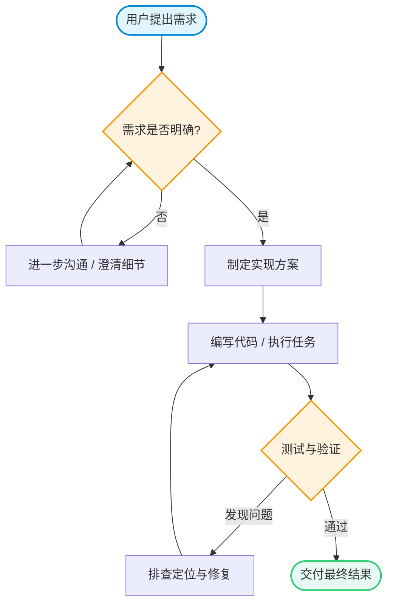

```mermaid
graph TD
    A([用户提出需求]) --> B{需求是否明确?}
    B -- 否 --> C[进一步沟通 / 澄清细节]
    C --> B
    B -- 是 --> D[制定实现方案]
    D --> E[编写代码 / 执行任务]
    E --> F{测试与验证}
    F -- 发现问题 --> G[排查定位与修复]
    G --> E
    F -- 通过 --> H([交付最终结果])

    style A fill:#e1f5fe,stroke:#0288d1,stroke-width:2px
    style H fill:#e8f8f5,stroke:#2ecc71,stroke-width:2px
    style F fill:#fff3e0,stroke:#f39c12,stroke-width:2px
    style B fill:#fff3e0,stroke:#f39c12,stroke-width:2px
```
